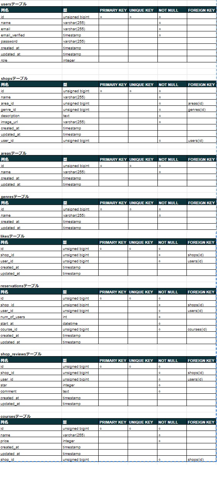

# アプリケーション名 "RESE" 
#### 飲食店予約サービス
#### 登録した店舗の紹介、予約、事前決済、口コミ閲覧、お気に入り登録が可能
#### トップページ画面

## 作成した目的
　卒業テスト用課題

## アプリケーションURL
　未登録
 
## 他のリポジトリ
　なし
 
## 機能一覧
- 一般ユーザー
    - 会員登録
    - メール認証機能
    - ログイン
    - ログアウト
    - ユーザー情報取得
    - お気に入り登録
    - お気に入り解除
    - お気に入り一覧表示
    - 店舗の絞込検索
    - 事前決済
    - 決済完了後予約
    - 予約削除
    - 予約履歴確認
    - 予約日当日にリマインドメール受信
    - リマインドメールに記載のQRコードでスムーズに入店
    - 来店後、口コミ及び点数評価投稿機能
    - 口コミ及び点数評価一覧表示
- 店舗責任者 
    - ログイン
    - ログアウト
    - 店舗情報変更
    - 店舗イメージ画像入れ替え（ストレージ保存）
    - 予約状況確認
    - 予約履歴確認
- 管理者
    - ログイン
    - ログアウト
    - 新規店舗登録
    - 登録店舗一覧表示
    - 登録している全一般ユーザーに対しメール送信
 
## テーブル仕様

## ER図

## 仕様技術
- Laravel 8.83.27
- composer 2.4.2
- php 8.1.10
- XAMPP 8.1.10
- Apache 2.4.54(win64)
- MySQL Ver 15.1 Distrib 10.4.25-MariaDB, for Win64 (AMD64)
- node.js v18.12.0

# 環境構築
- XAMPP 8.1.10
    -  https://sourceforge.net/projects/xampp/files/latest/download
  
- composer
    - https://getcomposer.org/Composer-Setup.exe
    - Composerインストール後、ターミナルもしくはコマンドプロンプトにて下記コマンド
    - $ brew install composer

- git clone https://github.com/MISAKI0512/Restaurant_Reservation_Services/archive/refs/heads/main.zip
    - $ composer install
    - .env.exampleを.envにリネーム
    - $ php artisan key:generate
    - $ php artisan migrate:fresh --seed

- node.js v18.12.0
    - https://nodejs.org/dist/v18.12.0/node-v18.12.0-x64.msi 
